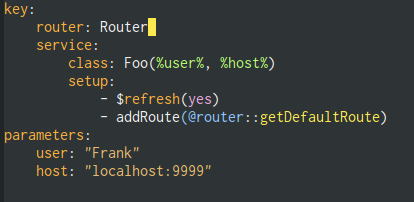

# neon-mode

Major mode for editing neon files: http://ne-on.org/

# Features

## Syntax highlighting

The mode provides some extra syntax highlighting on top of `conf-colon-mode`, specifically for the `@entities` and `%parameters%`, `::methodCalls` and `$variable`-style setup.

All the features should be demonstrated on the following screenshots (the colors of various elements use `font-lock` faces so they will look compatible with your theme).

## Jump-to-definition

If you use [composer autoloading](https://getcomposer.org/doc/01-basic-usage.md#autoloading) in your project you can use a "Jump to definition" functionality bound by default to `M-'`.  With the point on the class definition this will use the autoloader to find the definition file and visit it.  Use `pop-global-mark` to get back to the `neon` file.
